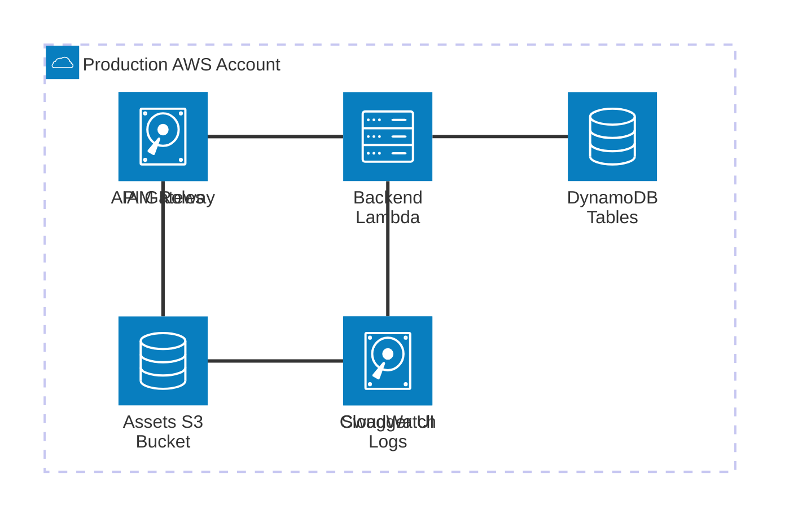
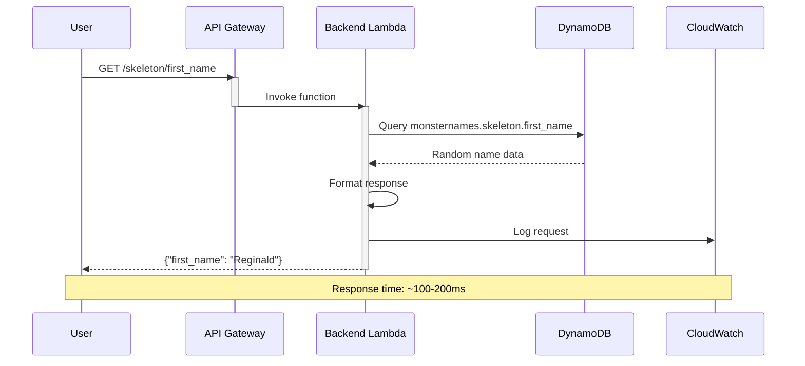

<!-- PROJECT LOGO -->
<br />
<div align="center">

<h3 align="center">sudoblark.monsternames.api</h3>

  <p align="center">
    A serverless REST API for generating pseudo-random fantasy monster names, demonstrating data-driven Terraform patterns with AWS API Gateway, Lambda, and DynamoDB - deployable through declarative infrastructure configuration.
  </p>
  <p align="center">
    <a href="https://monsternames.sudoblark.com">
      
    </a>
    <a href="https://github.com/sudoblark/sudoblark.monsternames.api/blob/main/LICENSE.txt">
      
    </a>
  </p>

</div>

<!-- TABLE OF CONTENTS -->
<details>
  <summary>Table of Contents</summary>
  <ol>
    <li><a href="#sudoblark-monsternames-api">sudoblark.monsternames.api</a></li>
    <li><a href="#architecture">Architecture</a></li>
    <li><a href="#api-endpoints">API Endpoints</a></li>
    <li><a href="#adding-new-infrastructure">Adding New Infrastructure</a>
      <ul>
        <li><a href="#adding-s3-buckets">Adding S3 Buckets</a></li>
        <li><a href="#adding-iam-roles">Adding IAM Roles</a></li>
        <li><a href="#adding-lambda-functions">Adding Lambda Functions</a></li>
        <li><a href="#adding-api-gateways">Adding API Gateways</a></li>
        <li><a href="#adding-s3-files">Adding S3 Files</a></li>
      </ul>
    </li>
    <li>
      <a href="#developer-documentation">Developer Documentation</a>
      <ul>
        <li><a href="#prerequisites">Prerequisites</a></li>
        <li><a href="#configuration">Configuration</a></li>
        <li><a href="#pre-commit-hooks">Pre-commit hooks</a></li>
      </ul>
    </li>
    <li><a href="#cicd">CI/CD</a></li>
    <li><a href="#data-management">Data Management</a>
      <ul>
        <li><a href="#exporting-dynamodb-tables">Exporting DynamoDB Tables</a></li>
        <li><a href="#importing-dynamodb-tables">Importing DynamoDB Tables</a></li>
      </ul>
    </li>
    <li><a href="#usage-example">Usage Example</a></li>
    <li><a href="#migration-guide">Migration Guide</a></li>
    <li><a href="#license">License</a></li>
  </ol>
</details>

# sudoblark.monsternames.api
Generate fantasy monster names through a serverless REST API with data-driven Terraform infrastructure!

## Architecture

This repository demonstrates a modularised, data-driven approach to deploying a production-grade serverless REST API. Instead of writing repetitive resource blocks, you define infrastructure in simple data structures that are automatically transformed into AWS resources.

**Core Components:**

- **`modules/data/`** - Data-driven configuration layer
  - [buckets.tf](modules/data/buckets.tf) - S3 bucket definitions (assets)
  - [iam_roles.tf](modules/data/iam_roles.tf) - IAM role and policy definitions
  - [lambdas.tf](modules/data/lambdas.tf) - Lambda function configurations
  - [api_gateways.tf](modules/data/api_gateways.tf) - API Gateway REST API definitions
  - [s3_files.tf](modules/data/s3_files.tf) - S3 file upload configurations (Swagger UI)
  - [defaults.tf](modules/data/defaults.tf) - Default values and common configuration
  - [infrastructure.tf](modules/data/infrastructure.tf) - Data enrichment and cross-reference resolution
  - [outputs.tf](modules/data/outputs.tf) - Processed data for infrastructure modules

- **`modules/infrastructure/`** - Reusable infrastructure modules
  - [s3/](modules/infrastructure/s3/) - S3 bucket creation with encryption and lifecycle policies
  - [iam/](modules/infrastructure/iam/) - IAM role creation with inline policies
  - [lambda/](modules/infrastructure/lambda/) - Lambda function deployment from ZIP files
  - [api-gateway/](modules/infrastructure/api-gateway/) - API Gateway REST API with OpenAPI specification
  - [s3-files/](modules/infrastructure/s3-files/) - S3 object uploads with templating support

- **`infrastructure/aws-sudoblark-production/`** - Production environment instantiation
  - Consumes the data module
  - Creates actual AWS resources using infrastructure modules
  - Manages state and provider configuration

**How It Works:**

1. **Data Definition** (`modules/data/`):
   - Define infrastructure in simple Terraform local values
   - Specify buckets, IAM roles, Lambdas, API Gateways, and their relationships
   - Configuration files include comprehensive docstrings with examples

2. **Data Enrichment** (`modules/data/infrastructure.tf`):
   - Automatically computes full resource names following naming conventions
   - Merges specific configurations with defaults
   - Resolves cross-references (role names → ARNs, Lambda names → ARNs, bucket names → full names)
   - Creates lookup maps for easy access
   - Resolves template variables for OpenAPI specifications

3. **Infrastructure Creation** (`infrastructure/aws-sudoblark-production/`):
   - Iterates over enriched data structures
   - Passes resolved configurations to infrastructure modules
   - Infrastructure modules create actual AWS resources
   - Manages dependencies (IAM → Lambda → API Gateway)

4. **API Gateway Integration**:
   - OpenAPI 3.0 specification defines REST API endpoints
   - API Gateway integrates with Lambda backend
   - Swagger UI hosted in S3 bucket for interactive documentation
   - Usage plans enforce rate limiting and quotas

**Key Benefits:**

- **Declarative**: Define "what" you want, not "how" to create it
- **DRY Principle**: Write configuration once, reuse across resources
- **Consistency**: Automatic naming conventions and tagging
- **Scalability**: Add new resources by adding data entries, not code
- **Maintainability**: Clear separation between data and logic
- **Production-Ready**: Includes IAM policies, encryption, monitoring

**Infrastructure Diagram:**



## API Endpoints

The MonsterNames API provides endpoints for generating themed fantasy monster names across different creature types.

**Base URL:** `https://monsternames.sudoblark.com`

**Available Endpoints:**

| Endpoint | Monster Type | Naming Theme | Example Response |
|----------|--------------|--------------|------------------|
| `/goatmen/first_name` | Goatmen | Cute fluffy animals | `{"first_name": "Fluffy"}` |
| `/goblin/first_name` | Goblin | Washed out wrestlers | `{"first_name": "The Crusher"}` |
| `/goblin/last_name` | Goblin | Average blokes | `{"last_name": "Johnson"}` |
| `/ogre/first_name` | Ogre | Caveman-like speech | `{"first_name": "Grug"}` |
| `/orc/first_name` | Orc | Noun + silly moniker | `{"first_name": "Stinky"}` |
| `/orc/last_name` | Orc | Silly monikers | `{"last_name": "the Unwashed"}` |
| `/skeleton/first_name` | Skeleton | 18th century gentlemen | `{"first_name": "Reginald"}` |
| `/skeleton/last_name` | Skeleton | British aristocracy | `{"last_name": "Worthington"}` |
| `/troll/first_name` | Troll | Scandinavian names | `{"first_name": "Bjorn"}` |
| `/troll/last_name` | Troll | Nordic surnames | `{"last_name": "Ironforge"}` |

**Interactive Documentation:**

Visit [https://monsternames.sudoblark.com](https://monsternames.sudoblark.com) to explore the API using Swagger UI with live request/response examples.

**Example Usage:**

```bash
# Get a random goatmen first name
curl https://monsternames.sudoblark.com/goatmen/first_name

# Get a random skeleton full name
FIRST=$(curl -s https://monsternames.sudoblark.com/skeleton/first_name | jq -r '.first_name')
LAST=$(curl -s https://monsternames.sudoblark.com/skeleton/last_name | jq -r '.last_name')
echo "$FIRST $LAST"
```

**Rate Limiting:**

- **Rate Limit:** 100 requests per second
- **Quota:** 500 requests per day
- **Burst:** Handles traffic spikes up to rate limit

## Adding New Infrastructure

All infrastructure changes are made by updating data structures in `modules/data/`. The Terraform code automatically processes these definitions and creates the corresponding AWS resources.

### Adding S3 Buckets

Update [modules/data/buckets.tf](modules/data/buckets.tf) to add new S3 buckets:

```terraform
# modules/data/buckets.tf
{
  name           = "backups"
  versioning     = true
  folder_paths   = ["daily/", "weekly/"]
  days_retention = 90
}
```

The bucket will automatically:
- Be named `aws-sudoblark-production-monsternames-api-backups` (all lowercase)
- Use S3-managed encryption (AES-256, no KMS costs)
- Pre-create the specified folder paths
- Include lifecycle policies
- Include default tags

### Adding IAM Roles

Update [modules/data/iam_roles.tf](modules/data/iam_roles.tf) to add new IAM roles:

```terraform
# modules/data/iam_roles.tf
{
  name = "data-processor"
  path = "/"
  assume_policy_principals = [
    {
      type        = "Service"
      identifiers = ["lambda.amazonaws.com"]
    }
  ]
  policy_statements = [
    {
      sid    = "AllowDynamoDBRead"
      effect = "Allow"
      actions = [
        "dynamodb:GetItem",
        "dynamodb:Query"
      ]
      resources = ["dynamodb:*"]
    },
    {
      sid    = "AllowCloudWatchLogs"
      effect = "Allow"
      actions = [
        "logs:CreateLogGroup",
        "logs:CreateLogStream",
        "logs:PutLogEvents"
      ]
      resources = ["logs:*"]
    }
  ]
}
```

The role will automatically:
- Be named `aws-sudoblark-production-monsternames-api-data-processor`
- Have resource ARNs resolved from short references
- Include trust policy for Lambda
- Include inline policy with specified statements

### Adding Lambda Functions

Update [modules/data/lambdas.tf](modules/data/lambdas.tf) to add new Lambda functions:

```terraform
# modules/data/lambdas.tf
{
  name             = "data-processor"
  description      = "Processes DynamoDB data for analytics"
  zip_file_path    = "./lambda-packages/data-processor.zip"
  handler          = "processor.handler"
  runtime          = "python3.11"
  timeout          = 120
  memory           = 512
  role_name        = "data-processor"
  environment_variables = {
    LOG_LEVEL = "INFO"
    TABLE_PREFIX = "monsternames"
  }
  lambda_layers = [
    "powertools-python"  # Auto-resolved to ARN
  ]
}
```

The Lambda will automatically:
- Be named `aws-sudoblark-production-monsternames-api-data-processor`
- Have its role ARN resolved from `role_name`
- Merge with defaults for unspecified values
- Resolve Lambda layer names to ARNs
- Include default tags

### Adding API Gateways

Update [modules/data/api_gateways.tf](modules/data/api_gateways.tf) to add new API Gateways:

```terraform
# modules/data/api_gateways.tf
{
  name              = "admin"
  description       = "Admin API for monster name management"
  openapi_spec_path = "./openapi/admin-api.yaml"
  template_variables = {
    admin_lambda_arn       = "admin-processor"  # Resolved to ARN
    aws_region_name        = "region"           # Resolved to actual region
    admin_role_arn         = "admin-role"       # Resolved to ARN
  }
  allowed_lambda_names = ["admin-processor"]
  quota_limit          = 100
  rate_limit           = 50
}
```

The API Gateway will automatically:
- Be named `aws-sudoblark-production-monsternames-api-admin`
- Resolve all template variables to actual ARNs/values
- Grant invoke permissions to specified Lambdas
- Create usage plan with rate limiting
- Deploy with OpenAPI specification

### Adding S3 Files

Update [modules/data/s3_files.tf](modules/data/s3_files.tf) to add new S3 file uploads:

```terraform
# modules/data/s3_files.tf
{
  name          = "admin-ui"
  source_path   = "./admin-ui/index.html"
  bucket_name   = "assets"
  object_key    = "admin/index.html"
  content_type  = "text/html"
}
```

The S3 file will automatically:
- Be uploaded to the resolved bucket
- Use correct content type
- Support template variable substitution (if needed)

**Configuration Pattern:**
- Each data file has comprehensive docstrings explaining structure and constraints
- All cross-references are resolved automatically (role names → ARNs, Lambda names → ARNs)
- Defaults are merged intelligently
- Naming conventions are applied consistently

## Developer Documentation

The below documentation is intended to assist a developer with interacting with the Terraform code in order to add, remove or update AWS infrastructure configurations.

All instructions, unless otherwise stated, are explicitly for MacOS.

### Prerequisites

* tfenv
```sh
git clone https://github.com/tfutils/tfenv.git ~/.tfenv
echo 'export PATH="$HOME/.tfenv/bin:$PATH"' >> ~/.bash_profile
```

* Virtual environment with pre-commit installed
```sh
python3 -m venv venv
source venv/bin/activate
pip install pre-commit
```

* AWS CLI configured with appropriate credentials
```sh
aws configure --profile sudoblark-production
```

* jq (for DynamoDB export/import scripts)
```sh
brew install jq
```

### Configuration

1. Update [modules/data/buckets.tf](modules/data/buckets.tf) to define S3 buckets
2. Update [modules/data/iam_roles.tf](modules/data/iam_roles.tf) to define IAM roles and policies
3. Update [modules/data/lambdas.tf](modules/data/lambdas.tf) to define Lambda functions
4. Update [modules/data/api_gateways.tf](modules/data/api_gateways.tf) to define API Gateway REST APIs
5. Update [modules/data/s3_files.tf](modules/data/s3_files.tf) to define S3 file uploads
6. Update [modules/data/defaults.tf](modules/data/defaults.tf) to adjust default values (if needed)

All data files include comprehensive docstrings with field descriptions, constraints, and examples.

### Pre-commit hooks

This repository utilises pre-commit to ensure code quality on every commit. The hooks automatically format and validate code before it's committed.

Install and run with:

```sh
source venv/bin/activate
pip install pre-commit
pre-commit install
pre-commit run --all-files
```

**Pre-commit hooks include:**

- **Terraform formatting** - Ensures consistent Terraform code style
- **YAML linting** - Validates GitHub Actions workflows
- **General file fixes** - Trailing whitespace, end-of-file fixes, merge conflict detection

All formatting is automatic - the hooks will fix issues and re-run validation.

## CI/CD

This repository uses GitHub Actions for continuous integration and deployment:

**Pull Request Checks:**
- **Format Check** - Validates Terraform formatting
- **Validate** - Runs `terraform validate`
- **Security Scan** - Checks for security vulnerabilities
- **Plan** - Generates and displays terraform plan

**Deployment Workflow:**
- Triggers on merge to main branch
- Requires approval for production deployment
- Automatically packages Lambda functions
- Applies infrastructure changes
- Uploads Swagger UI to S3

All checks must pass before merging. Deployments are gated with manual approval for production safety.

## Data Management

The MonsterNames API uses DynamoDB tables to store name data for each monster type. Use the provided scripts to backup and restore table data.

### Exporting DynamoDB Tables

Export all DynamoDB tables to JSON files for backup or migration:

```bash
# Export to default directory (./dynamodb-exports/TIMESTAMP/)
./scripts/export-dynamodb-tables.sh

# Export to custom directory
./scripts/export-dynamodb-tables.sh /path/to/backup
```

**What gets exported:**

The script exports all 10 DynamoDB tables:
- `monsternames.goatmen.first_name`
- `monsternames.goblin.first_name`
- `monsternames.goblin.last_name`
- `monsternames.ogre.first_name`
- `monsternames.orc.first_name`
- `monsternames.orc.last_name`
- `monsternames.skeleton.first_name`
- `monsternames.skeleton.last_name`
- `monsternames.troll.first_name`
- `monsternames.troll.last_name`

**Output structure:**

```
dynamodb-exports/
└── 20260209_143000/
    ├── export_summary.txt
    ├── monsternames_goatmen_first_name.json
    ├── monsternames_goblin_first_name.json
    ├── monsternames_goblin_last_name.json
    ├── monsternames_ogre_first_name.json
    ├── monsternames_orc_first_name.json
    ├── monsternames_orc_last_name.json
    ├── monsternames_skeleton_first_name.json
    ├── monsternames_skeleton_last_name.json
    ├── monsternames_troll_first_name.json
    └── monsternames_troll_last_name.json
```

### Importing DynamoDB Tables

Restore DynamoDB tables from a previous export:

```bash
./scripts/import-dynamodb-tables.sh ./dynamodb-exports/20260209_143000
```

**Features:**
- Batch imports items (handles DynamoDB's 25-item limit)
- Shows progress for large tables
- Automatically maps filenames back to table names

**Note:** Ensure DynamoDB tables exist before importing. Tables should be created by Terraform infrastructure.

## Usage Example

This repository includes a complete working example of a serverless REST API for generating fantasy monster names.

**API Request Flow:**



**Testing the API:**

1. **Access Swagger UI:**
   - Visit [https://monsternames.sudoblark.com](https://monsternames.sudoblark.com)
   - Browse interactive API documentation
   - Test endpoints directly in the browser

2. **Call API endpoints:**

```bash
# Get random skeleton name
curl https://monsternames.sudoblark.com/skeleton/first_name

# Get random orc full name
curl https://monsternames.sudoblark.com/orc/first_name
curl https://monsternames.sudoblark.com/orc/last_name

# Generate 5 goblin names
for i in {1..5}; do
  curl -s https://monsternames.sudoblark.com/goblin/first_name
done
```

3. **Monitor logs:**

```bash
# View Lambda logs
aws logs tail /aws/lambda/aws-sudoblark-production-monsternames-api-backend --follow

# Check API Gateway metrics
aws cloudwatch get-metric-statistics \
  --namespace AWS/ApiGateway \
  --metric-name Count \
  --dimensions Name=ApiName,Value=aws-sudoblark-production-monsternames-api-backend \
  --start-time $(date -u -d '1 hour ago' +%Y-%m-%dT%H:%M:%S) \
  --end-time $(date -u +%Y-%m-%dT%H:%M:%S) \
  --period 300 \
  --statistics Sum
```

**Pattern Demonstration:**

This example showcases:
- Data-driven infrastructure configuration for serverless APIs
- OpenAPI specification integration with API Gateway
- Lambda function backend with DynamoDB integration
- IAM role least-privilege permissions
- Automatic cross-resource linking (roles → Lambda → API Gateway → S3)
- S3-hosted Swagger UI for API documentation
- Cost-optimized infrastructure (S3 encryption, no API keys)
- Usage plans for rate limiting and quotas
- CloudWatch monitoring and logging
- Declarative infrastructure definitions

## License

See [LICENSE.txt](LICENSE.txt) for details.
