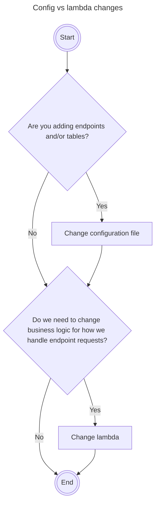

<!-- PROJECT LOGO -->
<br />
<div align="center">
  <a href="https://github.com/sudoblark/monsternames.api">
    
  </a>

<h3 align="center">monsternames.api</h3>

  <p align="center">
    Containerised lambda, and configuration, for backend of monsternames api.
  </p>
</div>


<!-- TABLE OF CONTENTS -->
<details>
  <summary>Table of Contents</summary>
  <ol>
    <li>
      <a href="#about-the-project">About The Project</a>
      <ul>
        <li><a href="#built-with">Built With</a></li>
      </ul>
    </li>
    <li><a href="#getting-started">Getting started</a></li>
    <li>
      <a href="#local-development">Local development</a>
      <ul>
        <li><a href="#pre-commit-hooks">Pre-commit hooks</a></li>
        <li><a href="#updating-the-configuration-file">Updating the configuration file</a></li>
        <li><a href="#updating-the-containerised-lambda">Updating the containerised lambda</a></li>
        <li><a href="#manually-testing-the-containerised-lambda">Manually testing the containerised lambda</a></li>
      </ul>
    </li>
    <li><a href="#environment-variables">Environment Variables</a></li>
    <li><a href="#automated-tests">Automated tests</a></li>
    <li><a href="#ci-cd-setup">CI/CD Setup</a></li>
    <li><a href="#contributing">Contributing</a></li>
    <li><a href="#license">License</a></li>
    <li><a href="#acknowledgments">Acknowledgments</a></li>
  </ol>
</details>


<!-- ABOUT THE PROJECT -->
## About The Project
This repo defines our containerised lambda for the API backend of monsternames.

Furthermore - via CI/CD - it also published said backend to AWS, in addition to uploading configuration
files for the lambda itself to S3.

<p align="right">(<a href="#readme-top">back to top</a>)</p>


### Built With

* [Docker](https://hub.docker.com)
* [Docker compose](https://docs.docker.com/compose/)
* [DynamoDB](https://aws.amazon.com/dynamodb/)
* [ConfigParser](https://docs.python.org/3/library/configparser.html)
* [boto3](https://boto3.amazonaws.com/v1/documentation/api/latest/index.html)
* [mermaid](https://mermaid.js.org)
* [behave!](https://behave.readthedocs.io/en/latest/)
* [makefile](https://www.gnu.org/software/make/manual/make.html)

<p align="right">(<a href="#readme-top">back to top</a>)</p>


<!-- GETTING STARTED -->
## Getting Started

1. Decide if you need to update the configuration file, the lambda, or both.



2. Make changes as appropriate as per the LOCAL DEVELOPMENT section.
3. Test your changes using the Behave! testing framework locally.
4. Submit a pull request.
5. Ensure automated checks pass, go through usual peer-review process.
6. Merge to main.
7. Once in main, a release on GitHub will automatically trigger a deployment to AWS.


<!-- LOCAL DEVELOPMENT -->
## Local Development
The below instructions are to assist local development of the containerised lambda and/or
the configuration file.

All instructions, unless otherwise stated, were only tested on MacOS.

### Pre-commit hooks
Pre-commit hooks are used to ensure appropriate formatting of code. To utilise:

1. Install pre-commit if you have not done so already:

```bash
pip3 install pre-commit
```

2. Install the hooks

```bash
pre-commit install
```

3. Do a pre-emptive run against all files:

```bash
pre-commit run --all-files
```

### Updating the configuration file
Simply add new section(s) to the `config.ini` file to denote new endpoints.

Endpoints may define the following attributes:

| Attribute        | Purpose                                                                                                        |
|------------------|----------------------------------------------------------------------------------------------------------------|
| first_name_table | Defines DynamoDB table to lookup for first names. If omitted, these are excluded from full_name concatenation. |
| last_name_table  | Defines DynamoDB table to lookup for last names. If omitted, these are excluded from full_name concatenation.  |

### Updating the containerised lambda

The lambdas main entrypoint is `handler` in `monsternames.api\main`. It also uses helper classes in `monsternames.api\utilities` to generalise and simplify as much as possible.

Simply update code as appropriate then move on to manual then automated testing.

### Manually testing the containerised lambda
Simply build and run the container, with a localised DynamoDB backend, using docker-compose.

1. `docker-compose up` will run a local DynamoDB instance, and monsternames container, on the same network.

2. You may then send test events to the container as follows:

```shell
curl "http://localhost:9000/2015-03-31/functions/function/invocations" -d '{"path": "/endpoint", "httpMethod": "METHOD", "Body": "PAYLOAD"}'
```

Where:
- "/endpoint" is a valid endpoint as per the configuration file
- "METHOD" is the HTTP method of our request, valid values are as per the open-api specification.
- "PAYLOAD" is the payload of a POST request. For example:

```
"{\"first_name\":\"fluffy\",\"last_name\":\"brown\"}"
```

3. Logs may be tailed as follows:

```bash
brew install jq
ID=$(docker ps --format '{"ID":"{{ .ID }}", "Image": "{{ .Image }}", "Names":"{{ .Names }}"}' | grep monsternamesapi | jq -r .ID)
docker logs -f $ID
```

4. You can also query the database directly, for debugging purposes, as follows:

```bash
export AWS_ACCESS_KEY_ID=DUMMYEXAMPLE
export AWS_SECRET_ACCESS_KEY=DUMMYEXAMPLEKEY
export AWS_DEFAULT_REGION=eu-west-1
aws dynamodb list-tables --endpoint-url http://localhost:8000
```

<p align="right">(<a href="#readme-top">back to top</a>)</p>

<!-- Environment Variables -->
## Environment Variables
The following environment variables may be used to configure the container:

| Env var           | Permissible values                       | Description                                                                                                                         |
|-------------------|------------------------------------------|-------------------------------------------------------------------------------------------------------------------------------------|
| CONFIG_FILE       | A valid file path                        | Points the lambda to its configuration file as outlined in the "Updating the configuration file" section of this README.            |
| LOG_LEVEL         | NOTSET,DEBUG,INFO,WARNING,ERROR,CRITICAL | Log level for the logger inside the container to utilise, if blank will default to INFO.                                            |
|

<p align="right">(<a href="#readme-top">back to top</a>)</p>

<!-- Automated tests -->
## Automated tests

There are Behave! feature tests setup to run behaviour tests, which tests:

- POST to every api endpoint with 5 unique values
- GET to every api endpoint between 5-10 times depending on underlying monster schema

Said tests should be run via the `makefile` to ensure the appropriate containers are running beforehand. As such, to
run behavioural tests simply follow the below commands:

1. Install makefile

```bash
brew install make
```

2. Run tests

```bash
make execute-behaviour-tests
```

<p align="right">(<a href="#readme-top">back to top</a>)</p>

<!-- CI/CD -->
## CI/CD setup
CI is setup such that, on an open pull request:
- Ruff is used to lint all Python files
- Behavioural tests - as outlined in the <a href="#automated-tests">Automated Tests</a> section - are run

<p align="right">(<a href="#readme-top">back to top</a>)</p>

<!-- CONTRIBUTING -->
## Contributing

If you have a suggestion that would make this better, please fork the repo and create a pull request. You can also simply open an issue with the tag "enhancement".
Don't forget to give the project a star! Thanks again!

1. Fork the Project
2. Create your Feature Branch (`git checkout -b feature/AmazingFeature`)
3. Commit your Changes (`git commit -m 'Add some AmazingFeature'`)
4. Push to the Branch (`git push origin feature/AmazingFeature`)
5. Open a Pull Request

<p align="right">(<a href="#top">back to top</a>)</p>

<!-- LICENSE -->
## License

Copyright (c) 2023, Sudoblark Ltd

All rights reserved.

This source code is licensed under the BSD 3 clause license found in the
LICENSE file in the root directory of this source tree.

<p align="right">(<a href="#readme-top">back to top</a>)</p>


<!-- ACKNOWLEDGMENTS -->
## Acknowledgments

* [Monster Creatures Fantasty](https://luizmelo.itch.io/monsters-creatures-fantasy) by luizmelo for the wonderful logo